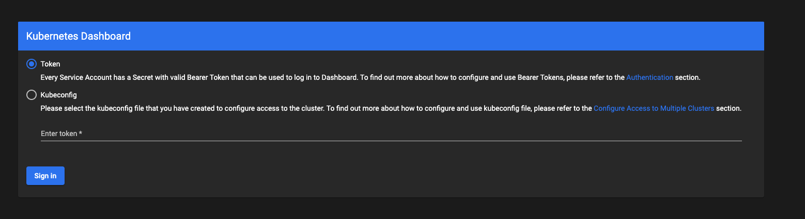
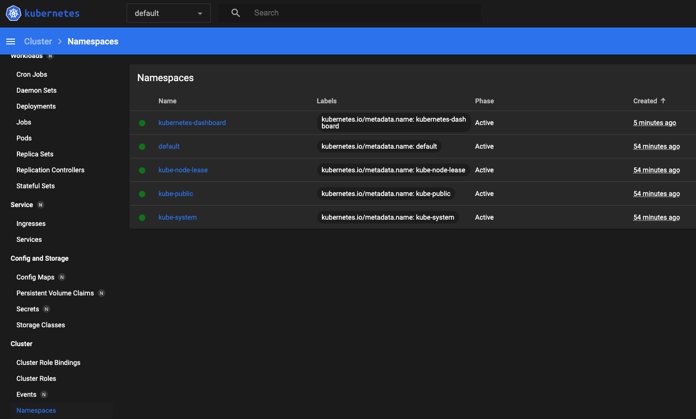

# Learn Terraform - Provision an EKS Cluster

This repo is a companion repo to the [Provision an EKS Cluster tutorial](https://developer.hashicorp.com/terraform/tutorials/kubernetes/eks), containing
Terraform configuration files to provision an EKS cluster on AWS.

Added the kubernetes UI dashboard

# Steps to use

- Run terraform apply

```
terraform apply
```
run takes about 10 minutes

- Configure kubectl with the following command

```
aws eks --region $(terraform output -raw region) update-kubeconfig \
    --name $(terraform output -raw cluster_name)
```

- Check it is working

```
kubectl cluster-info
Kubernetes control plane is running at https://B7B158A641CFDFF00EF9FCA4DF8E4DF7.gr7.us-east-2.eks.amazonaws.com
CoreDNS is running at https://B7B158A641CFDFF00EF9FCA4DF8E4DF7.gr7.us-east-2.eks.amazonaws.com/api/v1/namespaces/kube-system/services/kube-dns:dns/proxy
```

# Get the kubernetes Admin dashboard up and running
### following link

https://docs.aws.amazon.com/eks/latest/userguide/dashboard-tutorial.html

- Deploy the kubernetes dashboard UI

```
kubectl apply -f https://raw.githubusercontent.com/kubernetes/dashboard/v2.4.0/aio/deploy/recommended.yaml
```

- Create a user account
```
cat > eks-admin-service-account.yaml <<EOF
apiVersion: v1
kind: ServiceAccount
metadata:
  name: eks-admin
  namespace: kube-system
---
apiVersion: rbac.authorization.k8s.io/v1
kind: ClusterRoleBinding
metadata:
  name: eks-admin
roleRef:
  apiGroup: rbac.authorization.k8s.io
  kind: ClusterRole
  name: cluster-admin
subjects:
- kind: ServiceAccount
  name: eks-admin
  namespace: kube-system
EOF
```

- Create the account

```
kubectl apply -f eks-admin-service-account.yaml
```

- Get the token

```
kubectl -n kube-system describe secret $(kubectl -n kube-system get secret | grep eks-admin | awk '{print $1}')
```

- use the webbrowser to connect to the browser


- Run the proxy in a seperate window

```
kubectl proxy
```

- Use the following link to get the kubernetes dashboard

http://localhost:8001/api/v1/namespaces/kubernetes-dashboard/services/https:kubernetes-dashboard:/proxy/#/login

- Enter the token value

    

- You will get into the kubernetes dashboard

    